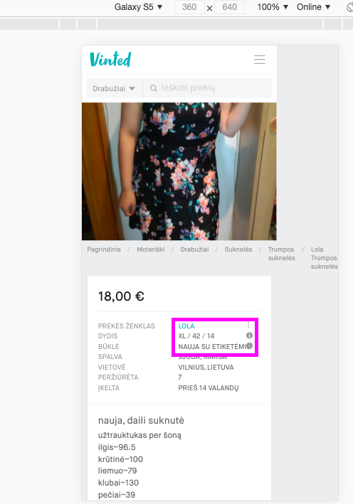
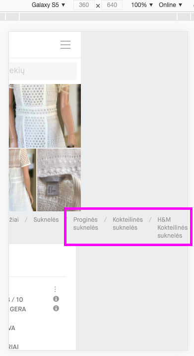

# Vinted
The goal of this project is to test and find all bugs and issues in vinted.lt website.

This is going to be Vinted bug and issue repository.

Operating systems used: macOS Mojave and Android.
Browser used: Google chrome.

#1 Issue

As you can see in the screenshot below, additional information button covers the last letters of the "NAUJA SU ETIKETĖMIS". It occurs on samsung galaxy S5 and any kind of device with the same or smaller measurements. It's a minor priority issue, because you can still read through it and it doesn't block anything important.

#2 Issue

Second issue is hyperlinks in the system. In the screenshot below you can see that a lot of links are crossing the screen border, so it makes website to look uncomfortable to use because it might slide to the right side any time. I suggest to make two shorter rows instead of one longer. It's a medium priority issue, because it's essential to have responsive design so that all members would feel satisfied and their journey in vinted would be as smooth as it can be.

